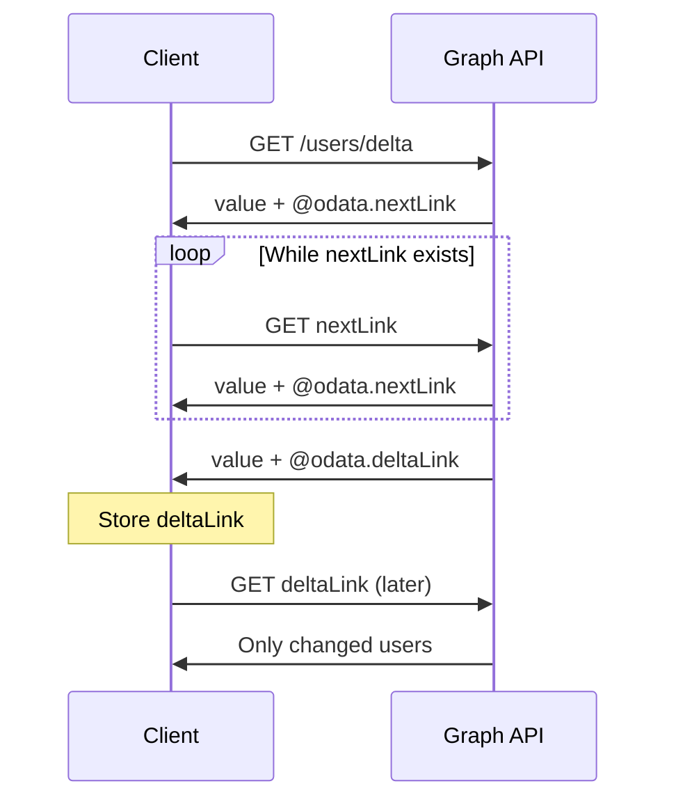

# Microsoft Graph API Guidelines

Comprehensive style rules based on Microsoft Graph API Guidelines. Microsoft Graph provides a unified API endpoint for accessing Microsoft 365 services including users, groups, mail, calendar, files, and more. This profile includes Graph-specific patterns like OData conventions, navigation properties, actions, functions, and delta queries.

## Metadata

- **Author:** Microsoft Graph Team
- **Source:** [https://github.com/microsoftgraph/api-guidelines](https://github.com/microsoftgraph/api-guidelines)
- **Last Updated:** 2024-12-01
- **License:** CC-BY-4.0

## Table of Contents

- [Introduction](#introduction)
- [Design Principles](#design-principles)
- [Conformance Levels](#conformance-levels)
- [Design Patterns](#design-patterns)
- **Rules**
  - [URI Design](#uri-design)
  - [OData Conventions](#odata-conventions)
  - [Navigation Properties](#navigation-properties)
  - [Actions and Functions](#actions-and-functions)
  - [Delta Queries](#delta-queries)
  - [Batch Requests](#batch-requests)
  - [Permissions](#permissions)
  - [Throttling](#throttling)
  - [Extensions](#extensions)
  - [Webhooks](#webhooks)
  - [Graph Naming](#graph-naming)
  - [Type Definitions](#type-definitions)
- [Glossary](#glossary)

## Introduction

Microsoft Graph is the gateway to data and intelligence in Microsoft 365. It provides a unified programmability model to access the tremendous amount of data in Microsoft 365, Windows, and Enterprise Mobility + Security.

This style specification formalizes the Microsoft Graph API design guidelines, which build on the Microsoft REST API Guidelines with additional patterns specific to the Graph API model.

## Design Principles

### Unified Endpoint

Microsoft Graph provides a single endpoint (graph.microsoft.com) for accessing all Microsoft 365 data and services.

**Related Rules:** GRAPH-URI-001

### OData Compliance

Microsoft Graph follows OData conventions for querying, filtering, and navigating resources.

**Related Rules:** GRAPH-ODATA-001, GRAPH-ODATA-002

### Incremental Synchronization

Delta queries enable clients to efficiently synchronize local data with Microsoft Graph.

**Related Rules:** GRAPH-DELTA-001, GRAPH-DELTA-002

### Batch Request Support

Batch requests allow clients to combine multiple operations into a single HTTP request.

**Related Rules:** GRAPH-BATCH-001

## Conformance Levels

### Bronze

Basic Microsoft Graph compliance

**Required Rules:**

- GRAPH-URI-001
- GRAPH-URI-003
- GRAPH-ODATA-001
- GRAPH-PERM-001
- GRAPH-THROTTLE-001

### Silver

Standard Microsoft Graph compliance

**Required Rules:**

- GRAPH-URI-001
- GRAPH-URI-002
- GRAPH-URI-003
- GRAPH-ODATA-001
- GRAPH-ODATA-002
- GRAPH-ODATA-003
- GRAPH-NAV-001
- GRAPH-ACT-001
- GRAPH-ACT-002
- GRAPH-PERM-001
- GRAPH-PERM-002
- GRAPH-THROTTLE-001
- GRAPH-THROTTLE-002
- GRAPH-NAME-001

### Gold

Full Microsoft Graph compliance

**Required Rules:**

- GRAPH-URI-001
- GRAPH-URI-002
- GRAPH-URI-003
- GRAPH-ODATA-001
- GRAPH-ODATA-002
- GRAPH-ODATA-003
- GRAPH-ODATA-005
- GRAPH-NAV-001
- GRAPH-NAV-002
- GRAPH-ACT-001
- GRAPH-ACT-002
- GRAPH-ACT-003
- GRAPH-DELTA-001
- GRAPH-DELTA-002
- GRAPH-DELTA-003
- GRAPH-BATCH-001
- GRAPH-PERM-001
- GRAPH-PERM-002
- GRAPH-PERM-003
- GRAPH-THROTTLE-001
- GRAPH-THROTTLE-002
- GRAPH-THROTTLE-003
- GRAPH-WEBHOOK-001
- GRAPH-WEBHOOK-002
- GRAPH-NAME-001
- GRAPH-NAME-002
- GRAPH-TYPE-001
- GRAPH-TYPE-003

## Design Patterns

### Delta Query for Change Tracking

Use delta queries to track changes to resources incrementally

**Problem:** Clients need to synchronize local data with Microsoft Graph efficiently without fetching all data repeatedly.

**Solution:** Use delta queries to get only changes since the last sync by calling the delta function and following deltaLinks.

**When to Use:** When building applications that need to keep local data in sync with Graph

**Initial Delta Request (Correct)**

```http
GET https://graph.microsoft.com/v1.0/users/delta HTTP/1.1
```

**Delta Response with Changes (Correct)**

```json
{
  "@odata.context": "...",
  "value": [
    {"id": "123", "displayName": "Updated Name"}
  ],
  "@odata.deltaLink": "https://graph.microsoft.com/v1.0/users/delta?$deltatoken=abc"
}
```

**Delta Query Flow**



**Related Rules:** GRAPH-DELTA-001, GRAPH-DELTA-002, GRAPH-DELTA-003

---

### JSON Batching

Combine multiple requests into a single HTTP call using JSON batching

**Problem:** Making many individual requests to Graph API is inefficient and may hit throttling limits.

**Solution:** Use the $batch endpoint to send multiple requests in a single HTTP call.

**When to Use:** When an operation requires multiple Graph API calls

**Batch Request (Correct)**

```json
{
  "requests": [
    {"id": "1", "method": "GET", "url": "/me"},
    {"id": "2", "method": "GET", "url": "/me/messages?$top=5"}
  ]
}
```

**Related Rules:** GRAPH-BATCH-001, GRAPH-BATCH-002

---

### Change Notifications via Webhooks

Subscribe to resource changes via webhooks instead of polling

**Problem:** Polling for changes is inefficient and delayed.

**Solution:** Create subscriptions to receive notifications when resources change.

**When to Use:** When applications need real-time awareness of resource changes

**Related Rules:** GRAPH-WEBHOOK-001, GRAPH-WEBHOOK-002, GRAPH-WEBHOOK-003

---

## URI Design

Graph-specific URL patterns and conventions

### GRAPH-URI-001: Use graph.microsoft.com endpoint

**Severity:** error

All Microsoft Graph API calls should use https://graph.microsoft.com as the service root. The URL pattern is:

https://graph.microsoft.com/{version}/{resource}

**Rationale:** Microsoft Graph provides a unified endpoint for all Microsoft 365 services.

**Examples:**

Good:

- `https://graph.microsoft.com/v1.0/users`
- `https://graph.microsoft.com/beta/me/messages`

Bad:

- `https://outlook.office.com/api/v2.0/me/messages`
- `https://api.microsoft.com/graph/users`

---

### GRAPH-URI-002: Support /me alias

**Severity:** warn

/me is an alias that refers to the signed-in user. It should be supported for all user-centric resources.

**Rationale:** The /me alias provides a convenient way for users to access their own resources.

**Examples:**

Good:

- `/me/messages`
- `/me/calendar/events`
- `/me/drive/root/children`

Bad:

- `Requiring /users/{id} for accessing own resources`

---

### GRAPH-URI-003: Use v1.0 for production, beta for preview

**Severity:** error

Microsoft Graph uses two versions:
- v1.0: Stable, production-ready APIs
- beta: Preview APIs that may change without notice

**Rationale:** v1.0 is the stable production version; beta is for preview features that may change.

**Examples:**

Good:

- `/v1.0/users (production)`
- `/beta/users (preview)`

Bad:

- `/v2/users`
- `/preview/users`

---

### GRAPH-VER-001: Support both v1.0 and beta versions

**Severity:** warn

Beta allows early access to new features while v1.0 ensures stability.

---

### GRAPH-VER-002: Document beta limitations

**Severity:** warn

Beta version documentation should clearly state that APIs may change and should not be used in production.

**Rationale:** Beta APIs may change without notice.

---

### GRAPH-DEPREC-001: Mark deprecated features in beta

**Severity:** warn

Deprecated features help developers plan migrations.

---

### GRAPH-SERVICE-001: Include service endpoint in documentation

**Severity:** error

Documentation must include the Graph service endpoint: https://graph.microsoft.com

**Rationale:** Service endpoint must be clearly documented.

---

### GRAPH-NATIONAL-001: Document national cloud endpoints

**Severity:** info

Document alternative endpoints for national clouds (US Gov, China, Germany).

**Rationale:** Some customers use national/sovereign clouds.

---

## OData Conventions

OData query parameters and patterns

### GRAPH-ODATA-001: Support standard OData query parameters

**Severity:** error

Microsoft Graph endpoints should support standard OData query parameters:
- $select: Choose which properties to return
- $filter: Filter results
- $orderby: Sort results
- $top: Limit number of results
- $skip: Skip results for pagination
- $expand: Include related resources
- $count: Include count of results

**Rationale:** OData query parameters provide a standardized way to filter, sort, and shape data.

**Examples:**

Good:

- `GET /users?$select=displayName,mail`
- `GET /users?$filter=department eq 'Sales'`
- `GET /users?$orderby=displayName`
- `GET /users?$top=10`

---

### GRAPH-ODATA-002: Use OData filter syntax

**Severity:** warn

Filter expressions should follow OData syntax:
- Comparison: eq, ne, gt, ge, lt, le
- Logical: and, or, not
- Functions: startswith, endswith, contains

**Rationale:** Consistent filter syntax makes APIs more predictable.

**Examples:**

Good:

- `$filter=displayName eq 'John'`
- `$filter=createdDateTime ge 2024-01-01`
- `$filter=startswith(displayName,'A')`

---

### GRAPH-ODATA-003: Support $expand for navigation properties

**Severity:** warn

Navigation properties should support $expand to include related entities in the response.

**Rationale:** $expand reduces the number of requests needed to fetch related data.

**Examples:**

Good:

- `GET /users/{id}?$expand=manager`
- `GET /groups/{id}?$expand=members`

---

### GRAPH-ODATA-004: Support nested $expand

**Severity:** info

Nested expand allows fetching deeper relationships in one request.

**Examples:**

Good:

- `GET /groups?$expand=members($select=displayName)`

---

### GRAPH-ODATA-005: Document filterable properties

**Severity:** warn

Not all properties may be filterable; documentation should be clear about limitations.

---

### GRAPH-META-001: Include @odata.context in responses

**Severity:** info

@odata.context provides metadata URL for the response.

---

### GRAPH-META-002: Include @odata.id for entities

**Severity:** info

@odata.id provides the canonical URL for an entity.

---

### GRAPH-SEARCH-001: Support $search query parameter

**Severity:** warn

Collections should support $search for full-text search across searchable properties.

**Rationale:** Full-text search improves resource discovery.

**Examples:**

Good:

- `GET /users?$search="displayName:John"`

---

### GRAPH-SEARCH-002: Document searchable properties

**Severity:** info

Not all properties may be searchable.

---

### GRAPH-COUNT-001: Support $count query parameter

**Severity:** info

Support $count=true to include @odata.count in response.

**Rationale:** $count provides total item count for UI pagination.

**Examples:**

Good:

- `GET /users?$count=true returns @odata.count`

---

### GRAPH-COUNT-002: Include ConsistencyLevel for count

**Severity:** info

Some $count queries require ConsistencyLevel: eventual header.

**Rationale:** Advanced queries may require eventual consistency mode.

---

### GRAPH-PAGING-001: Use @odata.nextLink for pagination

**Severity:** error

Collection responses with more results must include @odata.nextLink for pagination.

**Rationale:** Server-driven pagination using nextLink is the Graph standard.

---

### GRAPH-PAGING-002: Support $top for page size

**Severity:** warn

Support $top parameter to limit results per page.

**Rationale:** Clients may need to control page size for performance.

---

### GRAPH-PAGING-003: Document maximum page size

**Severity:** info

Clients need to know page size limits.

---

### GRAPH-PAGING-004: Support $skipToken for efficient pagination

**Severity:** info

$skipToken is more efficient than $skip for large datasets.

---

### GRAPH-FILTER-001: Support advanced filter operators

**Severity:** info

Support advanced filter operators: any, all for collections; lambda expressions.

**Rationale:** Advanced filters enable complex queries.

---

### GRAPH-FILTER-002: Document filter operator support

**Severity:** warn

Not all properties support all filter operators.

---

### GRAPH-PREFER-001: Support Prefer header options

**Severity:** info

Support Prefer header options like return=minimal, odata.maxpagesize.

**Rationale:** Prefer header allows client preferences for response behavior.

---

### GRAPH-IMMUT-001: Support Immutable-Id for mailbox items

**Severity:** info

Support Prefer: IdType="ImmutableId" for stable mailbox item identifiers.

**Rationale:** Immutable IDs persist even when items move between folders.

---

### GRAPH-PHOTO-001: Support $value for binary content

**Severity:** warn

Binary properties (photos, content) should be accessible via $value suffix.

**Rationale:** $value provides direct access to binary content.

**Examples:**

Good:

- `GET /me/photo/$value returns binary photo data`

---

### GRAPH-FORMAT-001: Support $format query parameter

**Severity:** info

$format allows requesting specific response formats.

---

### GRAPH-DERIVED-001: Support derived type filtering

**Severity:** info

Support filtering by derived type: /directoryObjects/microsoft.graph.user

**Rationale:** Filtering by type enables querying specific entity types in polymorphic collections.

**Examples:**

Good:

- `GET /directoryObjects/microsoft.graph.user`

---

### GRAPH-CAST-001: Support type casting in paths

**Severity:** info

Type casting allows accessing type-specific properties.

---

## Navigation Properties

Relationships and navigation between entities

### GRAPH-NAV-001: Define navigation properties for relationships

**Severity:** error

Relationships between entities should be expressed as navigation properties. For example, a user's manager is accessed via /users/{id}/manager.

**Rationale:** Navigation properties express relationships between entities and enable traversal.

**Examples:**

Good:

- `/users/{id}/manager`
- `/groups/{id}/members`
- `/me/events`

---

### GRAPH-NAV-002: Support direct navigation to related entities

**Severity:** warn

Clients should be able to navigate directly to related resources.

---

### GRAPH-NAV-003: Use $ref for relationship management

**Severity:** info

Relationships can be managed using $ref:
- POST /groups/{id}/members/$ref to add a member
- DELETE /groups/{id}/members/{userId}/$ref to remove a member

**Rationale:** $ref allows adding and removing relationships without modifying the entities themselves.

**Examples:**

Good:

- `POST /groups/{id}/members/$ref with {"@odata.id": "users/{userId}"}`
- `DELETE /groups/{id}/members/{userId}/$ref`

---

### GRAPH-SINGLETON-001: Use singletons for unique resources

**Severity:** info

Unique resources should be modeled as OData singletons.

**Rationale:** Singletons represent unique instances like /me or /organization.

**Examples:**

Good:

- `/me (singleton for current user)`
- `/organization (singleton)`

---

## Actions and Functions

Custom operations beyond CRUD

### GRAPH-ACT-001: Use POST for actions with side effects

**Severity:** error

OData actions are operations that may have side effects. They use POST and the action name appears in the URL path.

Examples:
- POST /me/sendMail
- POST /users/{id}/assignLicense

**Rationale:** Actions that modify state or have side effects must use POST.

**Examples:**

Good:

- `POST /me/sendMail`
- `POST /users/{id}/microsoft.graph.revokeSignInSessions`

Bad:

- `GET /me/sendMail (actions should use POST)`

---

### GRAPH-ACT-002: Use GET for functions without side effects

**Severity:** error

OData functions are read-only operations that return data. They use GET and the function name with parameters in the URL.

Examples:
- GET /me/drive/root/delta
- GET /users/{id}/reminderView(startDateTime='...',endDateTime='...')

**Rationale:** Functions that only return data should use GET for cacheability.

**Examples:**

Good:

- `GET /me/drive/root/delta`
- `GET /users/delta`

---

### GRAPH-ACT-003: Namespace custom actions

**Severity:** warn

Custom actions and functions should be prefixed with a namespace like 'microsoft.graph.'

**Rationale:** Namespacing prevents collisions and clarifies that an operation is custom.

**Examples:**

Good:

- `/users/{id}/microsoft.graph.revokeSignInSessions`

Bad:

- `/users/{id}/revokeSignInSessions (no namespace)`

---

### GRAPH-LRO-001: Use 202 Accepted for long-running operations

**Severity:** error

Operations that take more than a few seconds should return 202 Accepted with a status monitor URL.

**Rationale:** LROs should not block the client.

---

### GRAPH-LRO-002: Include Location header for LRO

**Severity:** error

Location header provides the status monitoring URL.

---

### GRAPH-LRO-003: Include percentComplete in status

**Severity:** info

Progress indication improves user experience.

---

## Delta Queries

Change tracking and incremental sync

### GRAPH-DELTA-001: Support delta queries for collections

**Severity:** warn

Collections that clients may want to sync should support the delta function. This returns changes since the last sync rather than all data.

**Rationale:** Delta queries enable efficient incremental synchronization.

**Examples:**

Good:

- `GET /users/delta`
- `GET /groups/delta`
- `GET /me/mailFolders/inbox/messages/delta`

---

### GRAPH-DELTA-002: Include @odata.deltaLink in final response

**Severity:** error

When all changes have been returned, the response must include @odata.deltaLink. Clients store this link and use it for the next sync.

**Rationale:** The deltaLink allows clients to resume sync from where they left off.

---

### GRAPH-DELTA-003: Indicate deleted items in delta

**Severity:** warn

Deleted items in delta responses should include @removed annotation.

**Rationale:** Clients need to know which items were deleted to update their local state.

**Examples:**

Good:

- `{"id": "123", "@removed": {"reason": "deleted"}}`

---

## Batch Requests

Combining multiple operations

### GRAPH-BATCH-001: Support JSON batching

**Severity:** warn

The $batch endpoint allows combining multiple requests into a single HTTP call. Requests are sent as a JSON array and responses are returned in the same order.

**Rationale:** Batch requests reduce HTTP overhead and help avoid throttling.

**Examples:**

Good:

- `POST /$batch with {"requests": [{"id": "1", "method": "GET", "url": "/me"}, {"id": "2", "method": "GET", "url": "/me/messages"}]}`

---

### GRAPH-BATCH-002: Support request dependencies in batch

**Severity:** info

Batch requests can specify dependencies using 'dependsOn' to sequence operations.

**Rationale:** Dependencies allow one request to use the result of another in the same batch.

---

### GRAPH-BATCH-003: Limit batch size

**Severity:** info

Batch requests should be limited to 20 requests per batch (Microsoft Graph limit).

**Rationale:** Large batches may time out or fail; smaller batches are more reliable.

---

### GRAPH-BATCH-004: Support atomic batch operations

**Severity:** info

Support atomicityGroup for transactional batch operations.

**Rationale:** Atomic batches ensure all-or-nothing semantics.

---

### GRAPH-BATCH-005: Limit batch to 20 requests

**Severity:** warn

Graph limits batch size to 20 requests.

---

## Permissions

Scopes and consent for Graph API

### GRAPH-PERM-001: Document required permissions

**Severity:** error

Each API endpoint must document the permissions (scopes) required to call it. Microsoft Graph uses a permission model with delegated (user) and application permissions.

**Rationale:** Clear permission documentation helps developers request appropriate consent.

---

### GRAPH-PERM-002: Support both delegated and application permissions

**Severity:** warn

APIs should support:
- Delegated permissions: For apps acting on behalf of a user
- Application permissions: For daemon/background apps

**Rationale:** Different scenarios require different permission types.

---

### GRAPH-PERM-003: Follow least-privilege principle

**Severity:** warn

Apps should request only the permissions they need.

---

### GRAPH-CONSENT-001: Support incremental consent

**Severity:** info

Incremental consent improves user experience by requesting permissions as needed.

---

### GRAPH-CONSENT-002: Document admin consent requirements

**Severity:** warn

Some permissions require admin consent.

---

### GRAPH-TENANT-001: Support multi-tenant access

**Severity:** warn

Multi-tenant apps need cross-tenant data access.

---

## Throttling

Rate limiting and best practices

### GRAPH-THROTTLE-001: Return 429 for throttling

**Severity:** error

When a client exceeds rate limits, return 429 Too Many Requests with Retry-After header.

**Rationale:** 429 is the standard HTTP status for rate limiting.

---

### GRAPH-THROTTLE-002: Include Retry-After header

**Severity:** error

Retry-After tells clients when to retry after being throttled.

---

### GRAPH-THROTTLE-003: Document rate limits

**Severity:** warn

Knowing rate limits helps developers design efficient applications.

---

### GRAPH-WORKLOAD-001: Document workload-specific limits

**Severity:** info

Document specific rate limits for workloads like Outlook, OneDrive, Teams, etc.

**Rationale:** Different workloads have different rate limits.

---

### GRAPH-RETRY-001: Document retry strategies

**Severity:** warn

Document recommended retry strategies with exponential backoff.

**Rationale:** Proper retry strategies prevent amplifying service issues.

---

## Extensions

Schema extensions and open extensions

### GRAPH-EXT-001: Support schema extensions

**Severity:** info

Schema extensions provide a way to add custom properties with defined types to Graph resources.

**Rationale:** Schema extensions allow adding typed custom properties to Graph resources.

---

### GRAPH-EXT-002: Support open extensions

**Severity:** info

Open extensions provide a way to add custom key-value data to supported resources without defining a schema.

**Rationale:** Open extensions allow adding untyped custom data to resources.

---

## Webhooks

Change notifications via webhooks

### GRAPH-WEBHOOK-001: Support change notifications

**Severity:** warn

Applications can subscribe to receive notifications when resources change. Subscriptions are created via POST /subscriptions.

**Rationale:** Webhooks enable real-time notifications without polling.

**Examples:**

Good:

- `POST /subscriptions with {"changeType": "created,updated,deleted", "notificationUrl": "https://...", "resource": "/users"}`

---

### GRAPH-WEBHOOK-002: Validate webhook endpoint

**Severity:** error

When creating a subscription, the notificationUrl must be validated by sending a validation token that the endpoint must echo back.

**Rationale:** Endpoint validation prevents subscribing to endpoints that don't exist or aren't controlled by the subscriber.

---

### GRAPH-WEBHOOK-003: Support subscription renewal

**Severity:** warn

Subscriptions should support renewal via PATCH to extend expirationDateTime.

**Rationale:** Subscriptions have expiration times and must be renewed to continue receiving notifications.

---

### GRAPH-CLIENT-001: Support client-state for webhooks

**Severity:** info

Webhook subscriptions should support clientState property that is echoed in notifications.

**Rationale:** Client-state helps verify notification origin.

---

### GRAPH-CLIENT-002: Include resource data in notifications

**Severity:** info

Support includeResourceData to include changed data in notifications (requires encryption).

**Rationale:** Rich notifications reduce follow-up API calls.

---

## Graph Naming

Graph-specific naming conventions

### GRAPH-NAME-001: Use camelCase for property names

**Severity:** error

All property names in Microsoft Graph use camelCase (e.g., displayName, userPrincipalName).

**Rationale:** Consistent naming improves API usability.

**Examples:**

Good:

- `displayName`
- `userPrincipalName`
- `createdDateTime`

Bad:

- `display_name`
- `UserPrincipalName`
- `DISPLAYNAME`

---

### GRAPH-NAME-002: Use DateTime suffix for timestamps

**Severity:** warn

Timestamp properties should use the DateTime suffix (e.g., createdDateTime, lastModifiedDateTime).

**Rationale:** Consistent timestamp naming clarifies data types.

**Examples:**

Good:

- `createdDateTime`
- `lastModifiedDateTime`
- `startDateTime`

Bad:

- `createdAt`
- `modified`
- `timestamp`

---

### GRAPH-NAME-003: Use consistent relationship names

**Severity:** warn

Common relationships should use standard names:
- members: Collection of users/devices in a group
- owners: Collection of users who own a resource
- manager: Single navigation property to a user's manager

**Rationale:** Consistent relationship names make navigation predictable.

**Examples:**

Good:

- `members`
- `owners`
- `manager`
- `directReports`

Bad:

- `groupMembers`
- `ownedBy`
- `supervisor`

---

## Type Definitions

Entity types and complex types

### GRAPH-TYPE-001: Define entity types with id property

**Severity:** error

Entity types must have an 'id' property that uniquely identifies the instance.

**Rationale:** Entity types have identities and can be addressed directly.

---

### GRAPH-TYPE-002: Use complex types for embedded data

**Severity:** info

Structured data that doesn't need to be addressed independently should be modeled as complex types (e.g., emailAddress, physicalAddress).

**Rationale:** Complex types represent structured data that doesn't need its own identity.

**Examples:**

Good:

- `emailAddress: { name: string, address: string }`
- `location: { displayName: string, address: physicalAddress }`

---

### GRAPH-TYPE-003: Include @odata.type for polymorphism

**Severity:** warn

When returning polymorphic data (e.g., directory objects that could be users or groups), include @odata.type to indicate the actual type.

**Rationale:** @odata.type enables type discrimination for polymorphic responses.

**Examples:**

Good:

- `{"@odata.type": "#microsoft.graph.user", "id": "123", "displayName": "John"}`

---

### GRAPH-TYPE-004: Use enums for fixed value sets

**Severity:** info

Properties with a fixed set of values should use enum types.

**Rationale:** Enums document and validate allowed values.

---

### GRAPH-ERR-001: Use standard Graph error format

**Severity:** error

Error responses must follow Graph error format with error.code, error.message, and optionally error.innerError.

**Rationale:** Consistent error format enables programmatic error handling.

**Examples:**

Good:

- `{"error": {"code": "InvalidRequest", "message": "The request is invalid.", "innerError": {...}}}`

---

### GRAPH-ERR-002: Include request-id in errors

**Severity:** warn

Error responses should include request-id in innerError for troubleshooting.

**Rationale:** Request IDs enable support to trace and debug errors.

---

### GRAPH-ERR-003: Include date in error innerError

**Severity:** info

Timestamp helps correlate errors with logs.

---

### GRAPH-STREAM-001: Support streaming for large content

**Severity:** info

Large content (files, attachments) should support streaming via $value endpoint.

**Rationale:** Streaming enables handling large files without memory issues.

**Examples:**

Good:

- `GET /me/drive/items/{id}/content for file download`

---

### GRAPH-STREAM-002: Support resumable upload

**Severity:** info

Large file uploads should support resumable upload sessions.

**Rationale:** Resumable uploads handle large files and network interruptions.

---

### GRAPH-SDK-001: Support standard SDK patterns

**Severity:** info

API design should work well with Microsoft Graph SDKs for various languages.

**Rationale:** SDK-friendly APIs improve developer experience.

---

### GRAPH-ETAG-001: Support ETags for concurrency

**Severity:** warn

Resources that can be updated should support ETags and If-Match headers.

**Rationale:** ETags prevent lost updates in concurrent modification scenarios.

---

### GRAPH-ETAG-002: Return 412 for ETag mismatch

**Severity:** warn

412 indicates the resource was modified since last fetch.

---

## Glossary

**Entity**
: A resource with an identity (id property), such as user, message, or event.

**Complex Type**
: A structured type without an identity, used as property values (e.g., emailAddress).

**Navigation Property**
: A property that links to related entities or collections.

**Delta Query**
: A query pattern for tracking incremental changes to resources.

**deltaToken**
: An opaque token representing a sync state for delta queries.

**deltaLink**
: A URL containing a deltaToken, used to get changes since last sync.

**Action**
: A POST operation that may have side effects (e.g., sendMail).

**Function**
: A GET operation that returns data without side effects (e.g., delta).

**Service Root**
: The base URL for Microsoft Graph: https://graph.microsoft.com/{version}/

**Change Notification**
: A webhook notification sent when a subscribed resource changes.

**Schema Extension**
: A way to add custom properties to Graph resources.

**Open Extension**
: Untyped data that can be added to supported Graph resources.

