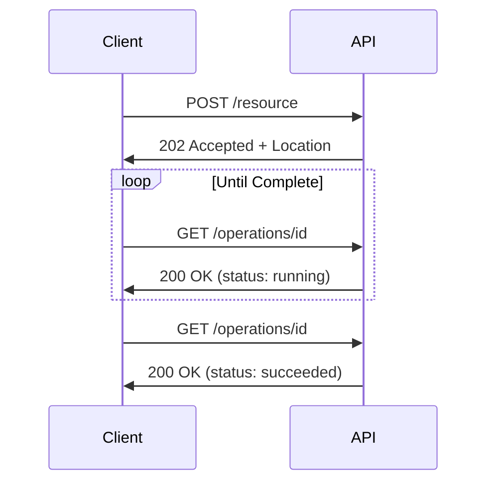

# Microsoft REST API Guidelines

Comprehensive style rules based on Microsoft Azure REST API Guidelines and Microsoft REST API Guidelines. This profile includes ~120 rules covering versioning, URI design, HTTP semantics, error handling, pagination, long-running operations, naming conventions, security, and more.

## Metadata

- **Author:** Microsoft
- **Source:** [https://github.com/microsoft/api-guidelines](https://github.com/microsoft/api-guidelines)
- **Last Updated:** 2024-12-01
- **License:** CC-BY-4.0

## Table of Contents

- [Introduction](#introduction)
- [Design Principles](#design-principles)
- [Conformance Levels](#conformance-levels)
- [Design Patterns](#design-patterns)
- **Rules**
  - [API Versioning](#api-versioning)
  - [URI Design](#uri-design)
  - [HTTP Methods](#http-methods)
  - [Request/Response](#request/response)
  - [Error Handling](#error-handling)
  - [Pagination](#pagination)
  - [Filtering and Sorting](#filtering-and-sorting)
  - [Long Running Operations](#long-running-operations)
  - [Naming Conventions](#naming-conventions)
  - [Security](#security)
  - [HTTP Headers](#http-headers)
  - [Schema Design](#schema-design)
  - [Collections](#collections)
  - [Conditional Requests](#conditional-requests)
  - [Compatibility](#compatibility)
- [Glossary](#glossary)

## Introduction

The Microsoft REST API Guidelines are a set of best practices for building consistent, reliable, and user-friendly REST APIs. These guidelines have evolved over many years of API development at Microsoft and represent lessons learned across Azure, Microsoft 365, and other Microsoft services.

This style specification formalizes these guidelines into machine-checkable rules that can be enforced during API design review and validation.

## Design Principles

### Consistency

APIs should be consistent with other Microsoft APIs and with common REST conventions. Developers who know one Microsoft API should feel comfortable with others.

**Related Rules:** MS-URI-001, MS-NAME-001, MS-REQ-001

### Simplicity

APIs should be simple to understand and use. Avoid unnecessary complexity, and prefer common patterns over custom ones.

**Related Rules:** MS-URI-004, MS-ERR-001

### Predictability

API behavior should be predictable. Developers should be able to guess how an API works based on general REST knowledge.

**Related Rules:** MS-HTTP-001, MS-HTTP-002, MS-HTTP-003

### Discoverability

APIs should be self-documenting and discoverable. Use hypermedia where appropriate to guide clients.

**Related Rules:** MS-PAGE-001, MS-LRO-001

### Extensibility

APIs should be designed to evolve without breaking existing clients. Use versioning and optional fields appropriately.

**Related Rules:** MS-VER-001, MS-VER-002, MS-COMPAT-001

## Conformance Levels

### Bronze

Basic Microsoft REST API compliance

**Required Rules:**

- MS-VER-001
- MS-URI-001
- MS-HTTP-001
- MS-SEC-001
- MS-SEC-004

### Silver

Standard Microsoft REST API compliance

**Required Rules:**

- MS-VER-001
- MS-VER-002
- MS-URI-001
- MS-URI-002
- MS-URI-003
- MS-HTTP-001
- MS-HTTP-002
- MS-HTTP-003
- MS-REQ-001
- MS-REQ-002
- MS-ERR-001
- MS-ERR-002
- MS-ERR-003
- MS-SEC-001
- MS-SEC-002
- MS-SEC-004

### Gold

Full Microsoft REST API compliance

**Required Rules:**

- MS-VER-001
- MS-VER-002
- MS-URI-001
- MS-URI-002
- MS-URI-003
- MS-URI-004
- MS-URI-005
- MS-URI-006
- MS-HTTP-001
- MS-HTTP-002
- MS-HTTP-003
- MS-HTTP-004
- MS-HTTP-008
- MS-REQ-001
- MS-REQ-002
- MS-REQ-003
- MS-REQ-004
- MS-ERR-001
- MS-ERR-002
- MS-ERR-003
- MS-ERR-004
- MS-PAGE-001
- MS-PAGE-002
- MS-LRO-001
- MS-SEC-001
- MS-SEC-002
- MS-SEC-003
- MS-SEC-004
- MS-SEC-005
- MS-HDR-001
- MS-COND-001
- MS-COMPAT-001

## Design Patterns

### Server-Driven Pagination

Use server-driven pagination with nextLink for large collections

**Problem:** Collections may contain more items than can be efficiently returned in a single response.

**Solution:** Return partial results with a nextLink URL pointing to the next page of results.

**When to Use:** When returning collections that may contain many items

**Paginated Response (Correct)**

```json
{
  "value": [
    {"id": "1", "name": "Item 1"},
    {"id": "2", "name": "Item 2"}
  ],
  "nextLink": "https://api.example.com/items?$skip=2&$top=2"
}
```

**Related Rules:** MS-PAGE-001, MS-PAGE-002, MS-PAGE-003

---

### Long Running Operations

Use 202 Accepted with Location header for long-running operations

**Problem:** Some operations take too long to complete within a single HTTP request timeout.

**Solution:** Return 202 Accepted immediately with a Location header pointing to a status monitor endpoint.

**When to Use:** When operations may take more than a few seconds to complete

**Initial Response (Correct)**

```http
HTTP/1.1 202 Accepted
Location: https://api.example.com/operations/abc123
Retry-After: 30
```

**LRO Flow**



**Related Rules:** MS-LRO-001, MS-LRO-002, MS-LRO-003

---

### Standard Error Response

Use consistent error response format with code, message, and details

**Problem:** Inconsistent error formats make it hard for clients to handle errors programmatically.

**Solution:** Use a standard error envelope with required code and message fields.

**When to Use:** When returning 4xx or 5xx responses

**Standard Error (Correct)**

```json
{
  "error": {
    "code": "InvalidParameter",
    "message": "The 'name' parameter must be between 1 and 100 characters.",
    "target": "name",
    "details": []
  }
}
```

**Related Rules:** MS-ERR-001, MS-ERR-002, MS-ERR-003, MS-ERR-004

---

### Optimistic Concurrency with ETags

Use ETags and If-Match headers for optimistic concurrency control

**Problem:** Concurrent updates to the same resource can overwrite each other's changes.

**Solution:** Return ETags with resources and require If-Match headers on update requests.

**When to Use:** When resources can be updated by multiple clients

**Conditional Update (Correct)**

```http
PATCH /users/123 HTTP/1.1
If-Match: "abc123"
Content-Type: application/json

{"name": "Updated Name"}
```

**Related Rules:** MS-COND-001, MS-COND-002, MS-COND-003

---

## API Versioning

Version management, compatibility, and evolution strategies

### MS-VER-001: Use api-version query parameter

**Severity:** error

All Microsoft REST APIs must include an api-version query parameter in requests. This parameter specifies which version of the API the client wants to use.

The api-version approach was chosen over URI versioning (/v1/...) because:
1. It keeps resource URIs stable across versions
2. It's explicitly visible in every request
3. It works well with API management proxies

**Rationale:** Microsoft APIs use the api-version query parameter for versioning. This allows the same URL structure across versions and makes version changes explicit.

**Examples:**

Good:

- `GET /users?api-version=2024-01-01`
- `POST /documents?api-version=2024-06-15-preview`

Bad:

- `GET /v1/users`
- `GET /users (no version)`

**Production API Call (Correct)**

```http
GET /subscriptions/sub-123/resourceGroups?api-version=2024-01-01 HTTP/1.1
Host: management.azure.com
Authorization: Bearer token123
```

Notes:

- Line 1: api-version parameter explicitly specifies the version

**Preview API Call (Correct)**

```http
GET /users?api-version=2024-06-15-preview HTTP/1.1
```

Notes:

- Line 1: Preview versions use -preview suffix

**URI Path Versioning (Incorrect) (Incorrect)**

```http
GET /v1/users HTTP/1.1
```

Notes:

- Line 1: URI path versioning is not used in Microsoft APIs

**References:**

- [Microsoft REST API Guidelines - Versioning](https://github.com/microsoft/api-guidelines/blob/vNext/Guidelines.md#versioning)
- [Azure API Versioning](https://github.com/microsoft/api-guidelines/blob/vNext/azure/Guidelines.md#api-versioning)

---

### MS-VER-002: Version format YYYY-MM-DD

**Severity:** error

API version strings must follow the YYYY-MM-DD format for general availability releases. Preview versions append '-preview' to the date.

Examples:
- GA: 2024-01-01
- Preview: 2024-06-15-preview

**Rationale:** Microsoft API versions use YYYY-MM-DD format (e.g., 2024-01-15) for GA releases and YYYY-MM-DD-preview for preview releases. This format is chronological and unambiguous.

**Examples:**

Good:

- `api-version=2024-01-01`
- `api-version=2024-06-15-preview`

Bad:

- `api-version=1.0`
- `api-version=v2`
- `api-version=2024.01.01`

**References:**

- [Azure API Version Format](https://github.com/microsoft/api-guidelines/blob/vNext/azure/Guidelines.md#api-versioning)

---

### MS-VER-003: Support multiple API versions

**Severity:** warn

A well-designed API should support at least the current version and one or two previous versions. This allows clients time to update their code when new versions are released.

**Rationale:** APIs should support multiple versions simultaneously to give clients time to migrate. Sudden version deprecation causes client failures.

---

### MS-VER-004: Document version differences

**Severity:** info

Clear documentation of version differences helps clients understand what changed and decide when to migrate.

---

## URI Design

Path structure, resource naming, and URL conventions

### MS-URI-001: Use lowercase paths

**Severity:** error

All URI paths must be lowercase. Mixed case paths can cause confusion and inconsistent behavior across different platforms.

**Rationale:** Lowercase paths ensure consistency and avoid case-sensitivity issues across different clients and servers.

**Examples:**

Good:

- `/users`
- `/resource-groups`
- `/storage-accounts`

Bad:

- `/Users`
- `/ResourceGroups`
- `/storageAccounts`

---

### MS-URI-002: Use plural resource names

**Severity:** error

Resource collection names should be plural nouns. Individual resources are accessed by ID within the collection.

For example:
- /users (collection)
- /users/{userId} (individual)

**Rationale:** Plural resource names indicate collections and maintain consistency with standard REST conventions.

**Examples:**

Good:

- `/users`
- `/subscriptions/{id}/resourceGroups`

Bad:

- `/user`
- `/subscription/{id}/resourceGroup`

---

### MS-URI-003: Use kebab-case for multi-word paths

**Severity:** error

Kebab-case (hyphen-separated) is the standard for URI path segments and improves readability.

**Examples:**

Good:

- `/resource-groups`
- `/storage-accounts`
- `/virtual-machines`

Bad:

- `/resourceGroups`
- `/storage_accounts`
- `/VirtualMachines`

---

### MS-URI-004: Avoid deep nesting

**Severity:** warn

Paths should not exceed 5-6 segments. If you find yourself needing deeper nesting, consider flattening the structure or using query parameters.

**Rationale:** Deep URL nesting makes APIs harder to use and remember. Most resources can be accessed with 3-4 levels.

**Examples:**

Good:

- `/users/{userId}/documents`
- `/subscriptions/{subId}/resourceGroups/{rgName}/resources`

Bad:

- `/orgs/{orgId}/teams/{teamId}/members/{memberId}/permissions/{permId}/roles/{roleId}`

---

### MS-URI-005: Use camelCase for path parameters

**Severity:** warn

Path parameter names should use camelCase for consistency with JSON property naming.

**Examples:**

Good:

- `/users/{userId}`
- `/subscriptions/{subscriptionId}`

Bad:

- `/users/{user_id}`
- `/subscriptions/{subscription-id}`

---

### MS-URI-006: Use nouns for resources, not verbs

**Severity:** error

URIs should represent resources (nouns), not actions (verbs). The HTTP method specifies what action to take on the resource.

**Rationale:** REST resources should be nouns. The HTTP method conveys the action (GET, POST, etc.).

**Examples:**

Good:

- `POST /users (create)`
- `DELETE /users/{id} (delete)`

Bad:

- `/createUser`
- `/deleteUser`
- `/getUsers`

---

### MS-URI-007: Avoid file extensions in URIs

**Severity:** warn

Content negotiation should be done via Accept headers, not file extensions.

**Examples:**

Good:

- `/users (with Accept: application/json)`

Bad:

- `/users.json`
- `/users.xml`

---

### MS-URI-008: Use consistent resource identifiers

**Severity:** warn

Resource identifiers should use consistent naming across the API (e.g., always {resourceId} or always {resource-id}).

---

### MS-ACTION-002: Use colon notation for actions

**Severity:** info

Actions on resources should use colon notation: /resources/{id}:actionName. This pattern is used in Azure APIs.

**Rationale:** Colon notation clearly distinguishes actions from resources.

**Examples:**

Good:

- `/subscriptions/{id}:cancel`
- `/databases/{id}:failover`

Bad:

- `/subscriptions/{id}/cancel`

---

### MS-REGION-001: Support region parameter for data residency

**Severity:** info

For multi-region APIs, include region in the URL path or use region-specific hostnames.

**Rationale:** Region parameters support data residency and sovereignty requirements.

---

### MS-AZURE-001: Include Azure subscription context

**Severity:** error

Azure Resource Manager APIs must include /subscriptions/{subscriptionId} and optionally /resourceGroups/{resourceGroupName} in the path.

**Rationale:** Azure APIs require subscription and resource group context for resource management.

**Examples:**

Good:

- `/subscriptions/{subscriptionId}/resourceGroups/{resourceGroupName}/providers/Microsoft.Compute/virtualMachines`

---

### MS-AZURE-002: Use provider namespace in Azure paths

**Severity:** error

Azure ARM paths must include /providers/{provider-namespace}/{resource-type} pattern.

**Rationale:** Provider namespaces identify the resource provider responsible for the resource type.

**Examples:**

Good:

- `/providers/Microsoft.Storage/storageAccounts`
- `/providers/Microsoft.Compute/virtualMachines`

---

## HTTP Methods

Proper use of GET, POST, PUT, PATCH, DELETE, and other HTTP verbs

### MS-HTTP-001: GET must not have request body

**Severity:** error

The HTTP/1.1 specification states that a GET request should not include a message body. Many intermediaries may strip or ignore bodies on GET requests.

**Rationale:** GET requests must not have a request body per HTTP specification. Request parameters should be in the URL.

**Examples:**

Good:

- `GET /users?status=active`

Bad:

- `GET /users with body {"status": "active"}`

---

### MS-HTTP-002: DELETE should return 204 No Content

**Severity:** warn

A successful DELETE should return 204 No Content with no response body. If the resource was already deleted, 204 is still appropriate (idempotency).

**Rationale:** Successful DELETE operations typically have no content to return, so 204 No Content is appropriate.

---

### MS-HTTP-003: POST should return 201 Created

**Severity:** warn

When POST creates a new resource, it should return 201 Created with:
- Location header pointing to the new resource
- The created resource in the response body

**Rationale:** POST operations that create resources should return 201 Created with a Location header.

---

### MS-HTTP-004: PUT is for full replacement

**Severity:** error

PUT semantics require sending the complete resource representation. The server replaces the existing resource with the request body.

For partial updates, use PATCH instead.

**Rationale:** PUT replaces the entire resource. Use PATCH for partial updates.

---

### MS-HTTP-005: PATCH for partial updates

**Severity:** warn

Use PATCH with application/merge-patch+json for partial resource updates. Only the fields included in the request are modified.

**Rationale:** PATCH allows clients to send only the fields they want to update, reducing payload size and avoiding conflicts.

---

### MS-HTTP-006: HEAD mirrors GET without body

**Severity:** info

HEAD should return the same headers as GET but without the response body. Useful for checking resource existence.

---

### MS-HTTP-007: OPTIONS for CORS preflight

**Severity:** info

OPTIONS requests are used for CORS preflight. The API should handle them appropriately.

---

### MS-HTTP-008: Use 200 for successful GET

**Severity:** error

Successful GET requests should return 200 OK with the requested resource.

---

### MS-IDEM-001: Support idempotency for POST operations

**Severity:** warn

POST operations should support idempotency via client-provided request IDs or natural keys. Use Repeatability-Request-ID header for retries.

**Rationale:** Idempotent POST operations prevent duplicate resource creation during retries.

---

### MS-ACTION-001: Use POST for action operations

**Severity:** warn

For operations that don't fit CRUD semantics (e.g., start, stop, cancel), use POST to a sub-resource named after the action.

**Rationale:** Non-CRUD actions on resources should use POST with a clear action name.

**Examples:**

Good:

- `POST /subscriptions/{id}:cancel`
- `POST /jobs/{id}/start`

Bad:

- `/cancelSubscription`
- `/subscriptions/{id}?action=cancel`

---

### MS-UPSERT-001: Support upsert with PUT

**Severity:** info

PUT operations may support upsert semantics: create if not exists, update if exists.

**Rationale:** Upsert simplifies client logic by creating or updating in one operation.

---

### MS-DELETE-001: DELETE should be idempotent

**Severity:** error

DELETE operations must be idempotent. Deleting a non-existent resource should return 204, not 404.

**Rationale:** Deleting an already-deleted resource should succeed, not return 404.

---

### MS-SOFT-001: Document soft delete behavior

**Severity:** info

If soft delete is supported, document the retention period and recovery mechanism.

**Rationale:** Soft delete allows resource recovery and meets compliance requirements.

---

## Request/Response

Payload structure, formats, and content negotiation

### MS-REQ-001: Use camelCase for JSON properties

**Severity:** error

All JSON property names should use camelCase (e.g., firstName, lastName, createdAt). This is consistent with JavaScript naming conventions.

**Rationale:** JSON property names must use camelCase for consistency with JavaScript conventions and other Microsoft APIs.

**Examples:**

Good:

- `{"firstName": "John", "lastName": "Doe"}`

Bad:

- `{"first_name": "John", "LastName": "Doe"}`

---

### MS-REQ-002: Use ISO 8601 for date-time

**Severity:** error

Date-time values must use ISO 8601 format with timezone information (e.g., 2024-01-15T10:30:00Z).

**Rationale:** ISO 8601 is the international standard for date and time representation and avoids ambiguity.

**Examples:**

Good:

- `2024-01-15T10:30:00Z`
- `2024-01-15T10:30:00+05:00`

Bad:

- `01/15/2024`
- `January 15, 2024`
- `1705315800`

---

### MS-REQ-003: Use strings for resource IDs

**Severity:** warn

Resource identifiers should be strings rather than integers. This supports:
- GUIDs/UUIDs
- Composite IDs
- Avoidance of JavaScript integer precision issues

**Rationale:** String IDs support various formats including GUIDs, while integers may overflow in JavaScript.

---

### MS-REQ-004: Use application/json content type

**Severity:** error

JSON is the standard format for Microsoft REST APIs.

---

### MS-REQ-005: Support content negotiation

**Severity:** info

Accept headers allow clients to specify preferred response formats.

---

### MS-REQ-006: Include self link in responses

**Severity:** info

Self links help clients discover the canonical URL of a resource.

---

### MS-NULL-002: Use null to clear optional fields

**Severity:** info

In PATCH requests, sending null for an optional field should clear/reset it.

**Rationale:** Consistent semantics for clearing field values via PATCH.

---

### MS-LINK-001: Include resource links

**Severity:** info

Resources should include links to related resources or actions (self, parent, children).

**Rationale:** Resource links enable navigation without URL construction.

---

### MS-LINK-002: Use @odata.id for resource identity

**Severity:** info

For OData-style APIs, include @odata.id with the canonical URL of the resource.

**Rationale:** OData ID provides canonical resource URL.

---

### MS-TIME-001: Use UTC for all timestamps

**Severity:** error

All date-time values should be in UTC with 'Z' suffix. Avoid local time zones.

**Rationale:** UTC timestamps avoid timezone confusion and simplify comparison.

**Examples:**

Good:

- `2024-01-15T10:30:00Z`

Bad:

- `2024-01-15T10:30:00+05:00`
- `2024-01-15T10:30:00`

---

### MS-TIME-002: Support time zone in date-only contexts

**Severity:** info

When using date (without time), document whether it's interpreted in UTC or a specific timezone.

**Rationale:** Date-only values may need timezone context for interpretation.

---

## Error Handling

Error response format, codes, and troubleshooting

### MS-ERR-001: Use standard error format

**Severity:** error

Error responses must follow the standard Microsoft error format:
```json
{
  "error": {
    "code": "ErrorCode",
    "message": "Human-readable message",
    "target": "optional field/property name",
    "details": []
  }
}
```

**Rationale:** A consistent error format allows clients to handle errors programmatically and display meaningful messages to users.

**Examples:**

Good:

- `{"error": {"code": "InvalidParameter", "message": "The parameter 'name' is invalid."}}`

Bad:

- `{"message": "Something went wrong"}`
- `{"error": "Invalid request"}`

---

### MS-ERR-002: Include error code

**Severity:** error

Machine-readable error codes allow clients to programmatically handle specific error conditions.

---

### MS-ERR-003: Include error message

**Severity:** error

Human-readable messages help developers understand and debug errors.

---

### MS-ERR-004: Use appropriate HTTP status codes

**Severity:** error

Use the most specific HTTP status code for each error condition:
- 400: Bad Request (validation errors)
- 401: Unauthorized (authentication required)
- 403: Forbidden (insufficient permissions)
- 404: Not Found (resource doesn't exist)
- 409: Conflict (resource state conflict)
- 429: Too Many Requests (rate limiting)
- 500: Internal Server Error (unexpected server error)

**Rationale:** HTTP status codes provide a standard way to communicate the result of a request.

**HTTP Status Code Selection**

Choose the appropriate status code based on the error condition

| Condition | Status Code | When to Use |
| --- | --- | --- |
| Invalid request body | 400 Bad Request | Malformed JSON, validation errors |
| Missing/invalid authentication | 401 Unauthorized | No token, expired token |
| Insufficient permissions | 403 Forbidden | Valid auth but no access |
| Resource not found | 404 Not Found | Resource ID doesn't exist |
| Optimistic concurrency failure | 409 Conflict | ETag mismatch |
| Rate limit exceeded | 429 Too Many Requests | Client exceeded quota |
| Server error | 500 Internal Server Error | Unexpected server failure |

---

### MS-ERR-005: Include error target when applicable

**Severity:** info

The target field helps identify which field or parameter caused the error.

---

### MS-ERR-006: Support error details for multiple errors

**Severity:** info

When multiple errors occur, returning all of them at once saves round trips.

---

### MS-BATCH-002: Return 207 Multi-Status for batch results

**Severity:** info

Batch operations should return 207 Multi-Status with individual status codes for each operation.

**Rationale:** 207 Multi-Status allows returning different status codes for each operation in a batch.

---

### MS-RETRY-001: Return Retry-After for 429 responses

**Severity:** error

429 Too Many Requests responses must include Retry-After header with seconds to wait.

**Rationale:** Retry-After helps clients implement proper backoff for rate limiting.

---

### MS-RETRY-002: Return Retry-After for 503 responses

**Severity:** warn

503 Service Unavailable responses should include Retry-After header.

**Rationale:** Retry-After helps clients handle temporary service unavailability.

---

### MS-INNERERR-001: Support inner error for debugging

**Severity:** info

Error responses may include innererror object with additional technical details for debugging.

**Rationale:** Inner error provides additional debugging context without exposing to end users.

---

## Pagination

Collection paging patterns and query options

### MS-PAGE-001: Use nextLink for pagination

**Severity:** error

Collection responses must include a 'nextLink' property when more results are available. The nextLink is an opaque URL that clients should follow without modification.

**Rationale:** Server-driven pagination with nextLink ensures consistent paging behavior and allows the server to control page size.

**Examples:**

Good:

- `{"value": [...], "nextLink": "https://api.example.com/items?$skip=100"}`

Bad:

- `{"items": [...], "page": 1, "totalPages": 10}`

---

### MS-PAGE-002: Support $top query parameter

**Severity:** warn

The $top parameter allows clients to request a specific number of results.

---

### MS-PAGE-003: Support $skip query parameter

**Severity:** info

The $skip parameter allows clients to skip a number of results for offset-based pagination.

---

### MS-PAGE-004: Support $count query parameter

**Severity:** info

The $count parameter allows clients to request the total count of items.

---

### MS-PAGE-005: Support maxpagesize parameter

**Severity:** info

Support maxpagesize query parameter or Prefer: maxpagesize=N header to control page size.

**Rationale:** Clients can request a specific page size up to the server's maximum.

---

### MS-PAGE-006: Support delta queries

**Severity:** info

For frequently accessed collections, support delta queries that return changes since the last request via deltaLink.

**Rationale:** Delta queries enable efficient synchronization by returning only changes.

---

## Filtering and Sorting

Query parameters for filtering, sorting, and selecting data

### MS-FILT-001: Support $filter query parameter

**Severity:** warn

Collection endpoints should support $filter for server-side filtering using OData-style expressions.

**Rationale:** The $filter parameter enables clients to filter collections server-side, reducing data transfer.

**Examples:**

Good:

- `GET /users?$filter=status eq 'active'`
- `GET /orders?$filter=amount gt 100`

Bad:

- `Requiring client-side filtering of large collections`

---

### MS-FILT-002: Support $orderby query parameter

**Severity:** warn

The $orderby parameter enables clients to sort results server-side.

**Examples:**

Good:

- `GET /users?$orderby=createdAt desc`
- `GET /products?$orderby=name asc`

---

### MS-FILT-003: Support $select query parameter

**Severity:** info

The $select parameter allows clients to request only specific properties, reducing payload size.

**Examples:**

Good:

- `GET /users?$select=id,name,email`

---

### MS-FILT-004: Support $expand query parameter

**Severity:** info

The $expand parameter allows clients to include related resources in a single request.

**Examples:**

Good:

- `GET /users?$expand=profile`
- `GET /orders?$expand=items,customer`

---

### MS-FILT-005: Document supported filter operations

**Severity:** info

Clients need to know which filter operations are supported for each property.

---

### MS-SEARCH-001: Support $search query parameter

**Severity:** info

Support $search query parameter for full-text search across multiple properties.

**Rationale:** Free-text search enables users to find resources without knowing exact field values.

**Examples:**

Good:

- `GET /documents?$search=quarterly report`

---

## Long Running Operations

Async operation patterns and status polling

### MS-LRO-001: Use 202 Accepted for long-running operations

**Severity:** error

Operations that may take more than a few seconds should:
1. Return 202 Accepted immediately
2. Include a Location header pointing to a status monitor
3. Include Retry-After header with polling interval

**Rationale:** Long-running operations should return immediately with 202 Accepted to avoid HTTP timeouts.

**Examples:**

Good:

- `HTTP/1.1 202 Accepted\nLocation: /operations/abc123\nRetry-After: 30`

---

### MS-LRO-002: Include Retry-After header

**Severity:** warn

Retry-After tells clients when to poll for status, preventing excessive polling.

---

### MS-LRO-003: Return operation result on completion

**Severity:** warn

When an LRO completes, the final status response should include the operation result.

---

### MS-LRO-004: Support operation cancellation

**Severity:** info

Allowing clients to cancel long-running operations saves resources.

---

### MS-LOC-002: Use Azure-AsyncOperation for LRO polling

**Severity:** warn

Azure LROs should return Azure-AsyncOperation header in addition to Location for status polling.

**Rationale:** Azure-AsyncOperation header provides the operation status URL.

---

### MS-LRO-005: Include operation status in LRO response

**Severity:** error

LRO status responses must include a status field with values: NotStarted, Running, Succeeded, Failed, Cancelled.

**Rationale:** Operation status indicates whether the operation is still running, succeeded, or failed.

**Examples:**

Good:

- `{"status": "Running", "percentComplete": 50}`

Bad:

- `{"completed": true}`

---

### MS-LRO-006: Include error in failed LRO

**Severity:** error

When an LRO fails, the status response must include error object with code and message.

**Rationale:** Failed operations must include error information for troubleshooting.

---

## Naming Conventions

Property, field, and schema naming standards

### MS-NAME-001: Use consistent naming patterns

**Severity:** warn

Similar concepts should use consistent naming across the API. For example, don't mix 'createdDateTime' and 'createTime'.

**Rationale:** Consistent naming reduces cognitive load and makes APIs more predictable.

**Examples:**

Good:

- `createdAt, updatedAt (consistent)`
- `firstName, lastName (consistent)`

Bad:

- `createdDateTime, modified_at (inconsistent)`

---

### MS-NAME-002: Use full words over abbreviations

**Severity:** info

Full words are clearer than abbreviations for API users unfamiliar with domain jargon.

**Examples:**

Good:

- `configuration (not config)`
- `identifier (not id, though id is acceptable)`
- `description (not desc)`

Bad:

- `cfg`
- `desc`
- `val`

---

### MS-NAME-003: Use domain-appropriate terminology

**Severity:** info

Use terminology that matches the domain and is understood by the target audience.

---

### MS-NAME-004: Boolean properties should be positive

**Severity:** info

Positive boolean names (isEnabled, isActive) are easier to understand than negative ones.

**Examples:**

Good:

- `isEnabled`
- `isActive`
- `hasAccess`

Bad:

- `isDisabled`
- `isNotActive`
- `noAccess`

---

## Security

Authentication, authorization, and data protection

### MS-SEC-001: Define security scheme

**Severity:** error

Every API must define at least one security scheme in the OpenAPI specification.

**Rationale:** APIs must document their authentication requirements for security and usability.

---

### MS-SEC-002: Apply security globally

**Severity:** error

Security should be applied at the API level to ensure all endpoints are protected by default.

---

### MS-SEC-003: Use OAuth2 with Azure AD

**Severity:** warn

OAuth2 with Azure AD provides enterprise-grade authentication and integrates with Microsoft identity.

---

### MS-SEC-004: Use HTTPS only

**Severity:** error

All API traffic must be encrypted using HTTPS to protect sensitive data.

---

### MS-SEC-005: Document required scopes

**Severity:** warn

OAuth scopes define granular permissions; documenting required scopes helps clients request appropriate access.

---

### MS-SEC-006: Support rate limiting

**Severity:** warn

Rate limiting protects APIs from abuse and ensures fair resource allocation.

---

### MS-WEBHOOK-002: Include validation challenge for webhooks

**Severity:** info

Webhook creation should include a validation challenge that the endpoint must echo back.

**Rationale:** Validation challenges verify webhook endpoint ownership.

---

### MS-TENANT-001: Support multi-tenant isolation

**Severity:** error

Multi-tenant APIs must include tenant context in path or via headers and enforce tenant isolation.

**Rationale:** Multi-tenant APIs must ensure tenant isolation for security.

---

### MS-PRIV-001: Minimize PII in URLs

**Severity:** error

Avoid including personal identifiable information (email, names) in URL paths or query parameters.

**Rationale:** PII in URLs can be logged and exposed, violating privacy requirements.

**Examples:**

Good:

- `/users/{userId}`

Bad:

- `/users/john.doe@example.com`

---

## HTTP Headers

Standard and custom header usage

### MS-HDR-001: Return request-id header

**Severity:** warn

All responses should include a request-id (or x-ms-request-id) header with a unique identifier for the request.

**Rationale:** Request IDs enable request tracing and debugging across distributed systems.

---

### MS-HDR-002: Support client-request-id header

**Severity:** info

Client-provided request IDs help correlate requests with client-side logs.

---

### MS-HDR-003: Include Date header

**Severity:** info

The Date header indicates when the response was generated.

---

### MS-HDR-004: Use standard Content-Type header

**Severity:** error

Content-Type must accurately describe the response body format.

---

### MS-TRACE-001: Support distributed tracing headers

**Severity:** warn

APIs should support and propagate traceparent and tracestate headers (W3C Trace Context) for distributed tracing.

**Rationale:** Distributed tracing enables end-to-end request tracking across services.

---

### MS-TRACE-002: Include correlation-id in responses

**Severity:** info

Responses should include x-ms-correlation-request-id or similar correlation header that links requests.

**Rationale:** Correlation IDs help track requests across distributed systems for debugging.

---

### MS-IDEM-002: Support Repeatability-Request-ID header

**Severity:** info

Support Repeatability-Request-ID and Repeatability-First-Sent headers for retry scenarios. Return same result for repeated requests.

**Rationale:** Repeatability headers enable safe retries without duplicate side effects.

---

### MS-DEPREC-001: Return Deprecation header for deprecated APIs

**Severity:** warn

Deprecated API versions or endpoints should return Deprecation header with deprecation date.

**Rationale:** Deprecation header alerts clients programmatically about deprecated endpoints.

---

### MS-DEPREC-002: Include Sunset header for deprecated APIs

**Severity:** warn

APIs scheduled for removal should include Sunset header with the removal date.

**Rationale:** Sunset header tells clients when an API will be permanently removed.

---

### MS-LOC-001: Return Location header on resource creation

**Severity:** error

201 Created responses must include Location header pointing to the created resource.

**Rationale:** Location header provides the URL of the newly created resource.

---

### MS-CACHE-001: Include Cache-Control headers

**Severity:** info

GET responses should include appropriate Cache-Control headers (no-cache, max-age, etc.).

**Rationale:** Cache-Control enables efficient caching and reduces server load.

---

### MS-LOCALE-001: Support Accept-Language for localization

**Severity:** info

Support Accept-Language header for localizing error messages and display content.

**Rationale:** Accept-Language enables localized responses for user-facing content.

---

## Schema Design

JSON Schema structure and data types

### MS-SCHEMA-001: Define all schemas

**Severity:** error

All request and response bodies should have defined schemas for documentation and validation.

---

### MS-SCHEMA-002: Include schema descriptions

**Severity:** warn

Schema descriptions help developers understand the purpose of each property.

---

### MS-SCHEMA-003: Use appropriate data types

**Severity:** error

Using correct data types enables proper validation and client SDK generation.

---

### MS-SCHEMA-004: Define required properties

**Severity:** warn

Marking required properties helps clients understand what data must be provided.

---

### MS-SCHEMA-005: Use enums for fixed values

**Severity:** info

Enums document valid values and enable validation.

---

### MS-SCHEMA-006: Include format for strings

**Severity:** info

String formats (date-time, email, uri) enable proper validation and documentation.

---

### MS-MUTAB-001: Document field mutability

**Severity:** warn

Document whether each property is: write-once (only set on create), read-only (server-generated), or read-write (can be updated).

**Rationale:** Knowing whether fields can be updated helps clients understand API behavior.

---

### MS-MUTAB-002: Use readOnly for computed properties

**Severity:** warn

Properties that are server-generated (id, createdAt, etag) should be marked readOnly: true in the schema.

**Rationale:** Marking computed properties as readOnly prevents clients from trying to set them.

---

### MS-NULL-001: Document null handling

**Severity:** warn

Document whether null values are allowed and their meaning (unset vs default).

**Rationale:** Clear null semantics prevent confusion about missing vs null values.

---

### MS-MODEL-001: Use discriminator for polymorphic types

**Severity:** warn

Polymorphic schemas using oneOf/anyOf should include a discriminator property (e.g., @odata.type).

**Rationale:** Discriminators enable proper deserialization of polymorphic types.

---

### MS-MODEL-002: Use @odata.type for derived types

**Severity:** info

For APIs using OData conventions, include @odata.type for polymorphic resources.

**Rationale:** OData type annotations enable runtime type identification.

---

### MS-DOC-001: Include operation descriptions

**Severity:** warn

Every operation should have a description explaining its purpose and behavior.

**Rationale:** Operation descriptions help developers understand API behavior.

---

### MS-DOC-002: Include operation summary

**Severity:** warn

Every operation should have a summary (short title) in addition to description.

**Rationale:** Operation summaries provide quick understanding of endpoint purpose.

---

### MS-DOC-003: Include example values

**Severity:** info

Schema properties should include example values to illustrate expected formats.

**Rationale:** Examples help developers understand expected data formats.

---

### MS-VALID-001: Document validation constraints

**Severity:** warn

Document validation constraints: minLength, maxLength, pattern, minimum, maximum, etc.

**Rationale:** Validation constraints help clients submit valid requests.

---

## Collections

List operations and collection management

### MS-COLL-001: Use value array for collections

**Severity:** error

Collection responses must use a 'value' property to contain the array of items.

**Rationale:** Microsoft APIs use 'value' as the property name for collection arrays to ensure consistency.

**Examples:**

Good:

- `{"value": [{"id": "1"}, {"id": "2"}]}`

Bad:

- `{"items": [...]}`
- `{"data": [...]}`

---

### MS-COLL-002: Include @odata.count when requested

**Severity:** info

Total count helps clients display pagination information.

---

### MS-COLL-003: Return empty array for empty collections

**Severity:** error

Empty collections should return an empty array, not null or omit the property.

**Examples:**

Good:

- `{"value": []}`

Bad:

- `{"value": null}`
- `{}`

---

### MS-BATCH-001: Support batch operations

**Severity:** info

For high-volume scenarios, support JSON batch requests to process multiple operations in a single HTTP request.

**Rationale:** Batch operations reduce round trips for bulk operations.

---

### MS-WEBHOOK-001: Support webhook subscriptions

**Severity:** info

For event-driven scenarios, support webhook subscriptions with subscription management endpoints.

**Rationale:** Webhooks enable real-time notifications without polling.

---

## Conditional Requests

ETags, If-Match, and optimistic concurrency

### MS-COND-001: Support ETag for resources

**Severity:** warn

Resources that support updates should return an ETag header. The ETag value should change whenever the resource changes.

**Rationale:** ETags enable optimistic concurrency control and efficient caching.

---

### MS-COND-002: Support If-Match for updates

**Severity:** warn

PUT and PATCH operations should support If-Match header to prevent concurrent modification conflicts.

**Rationale:** If-Match prevents lost updates by requiring clients to provide the current ETag.

---

### MS-COND-003: Return 412 for ETag mismatch

**Severity:** warn

412 Precondition Failed indicates the resource was modified since the client last fetched it.

---

### MS-COND-004: Support If-None-Match for caching

**Severity:** info

If-None-Match enables efficient caching by returning 304 Not Modified when resources haven't changed.

---

### MS-CACHE-002: Support conditional GET with Last-Modified

**Severity:** info

Support Last-Modified response header and If-Modified-Since request header for caching.

**Rationale:** Last-Modified enables time-based conditional requests.

---

## Compatibility

Breaking changes and evolution guidelines

### MS-COMPAT-001: Avoid breaking changes

**Severity:** error

API changes within a version must be backward compatible:
- Don't remove fields from responses
- Don't change field types
- Don't add required fields to request bodies
- Don't change the meaning of existing fields

**Rationale:** Breaking changes force clients to update their code and can cause outages.

---

### MS-COMPAT-002: New fields should be optional

**Severity:** warn

Adding required fields to existing requests breaks existing clients.

---

### MS-COMPAT-003: Use extensible enums

**Severity:** info

Clients should handle unknown enum values gracefully. The x-ms-enum extension with modelAsString can help.

**Rationale:** Enums should be designed to allow new values without breaking clients.

---

### MS-COMPAT-004: Document deprecations clearly

**Severity:** warn

Clear deprecation notices give clients time to migrate.

---

## Glossary

**Resource**
: An entity exposed by the API, identified by a URI.

**Collection**
: A set of resources of the same type.

**Operation**
: An action performed on a resource using an HTTP method.

**LRO**
: Long Running Operation - an operation that takes more than a few seconds to complete.

**ETag**
: Entity Tag - a version identifier for a resource used in conditional requests.

**nextLink**
: A URL pointing to the next page of results in a paginated collection.

**OData**
: Open Data Protocol - a standard for building RESTful APIs with query capabilities.

**HATEOAS**
: Hypermedia as the Engine of Application State - REST principle where responses include links to related resources.

